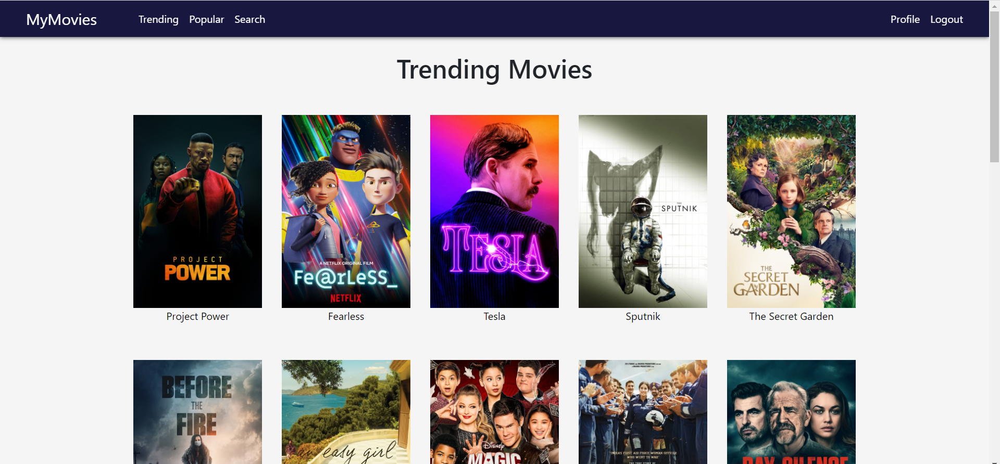

# MyMoviesNew
A website that lets to see trending, popular movies, write reviews, and also rate your seen movies.



# Link to live version 
https://tranquil-headland-23548.herokuapp.com/

# For this project I used:

* Client side - React.js
* Server side - Node.js
* Database - MongoDB/Mongoose
* Node.js Framework - Express.js


## Installation

```sh
npm install
npm start
```

## Meta

Tautvydas Gustas - https://github.com/TautvydasGustas1 / https://www.linkedin.com/in/tautvydas-gustas/
Licence - MIT

## Contributing

1. Fork it
2. Create your feature branch (`git checkout -b feature/fooBar`)
3. Commit your changes (`git commit -am 'Add some fooBar'`)
4. Push to the branch (`git push origin feature/fooBar`)
5. Create a new Pull Request

